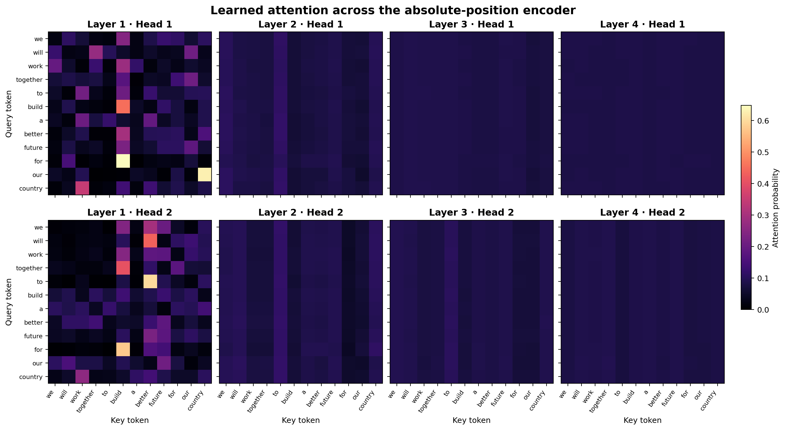
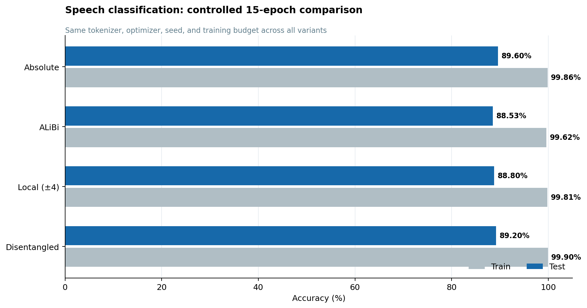
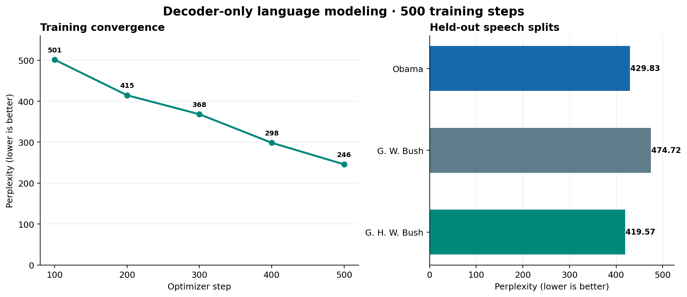

# PyTorch Transformers From Scratch

[](https://github.com/WeiHanTu/pytorch-transformers-from-scratch/actions/workflows/tests.yml)
[](https://www.python.org/)
[](https://pytorch.org/)
[](LICENSE)

A compact, readable implementation of Transformer encoder and decoder blocks using PyTorch
primitives. The project trains a three-way political-speech classifier and a word-level causal
language model, then compares absolute positions, ALiBi, local-window masking, and
DeBERTa-inspired disentangled attention.

No `nn.MultiheadAttention`, `nn.Transformer`, or third-party model implementation is used. The
attention projections, masks, residual paths, normalization, pooling, language-model head,
training loops, and perplexity evaluation are all explicit in the repository.

> Originally developed for UCSD CSE 256 in Fall 2024 and subsequently prepared for public release.

## What I implemented

- Scaled dot-product multi-head self-attention with inspectable per-head attention maps
- A bidirectional encoder with padding-aware mean pooling and an MLP classification head
- A decoder-only language model with causal masking and tied input/output embeddings
- Learned absolute positions and a bidirectional adaptation of ALiBi
- Symmetric local-window masking with a configurable receptive field
- DeBERTa-inspired content-to-content, content-to-position, and position-to-content scores
- Deterministic word-level tokenization with no runtime downloads
- Reproducible training, device selection (`MPS` → `CUDA` → `CPU`), gradient clipping, and JSON metrics
- Unit tests for shapes, gradients, padding invariance, probability normalization, and mask semantics

## Architecture

The classification path is:

```text
tokens + positions/bias
        │
        ▼
┌──────────────────────────────┐
│ pre-norm → self-attention    │
│          → residual          │  × 4
│ pre-norm → ReLU feed-forward │
│          → residual          │
└──────────────────────────────┘
        │
        ▼
padding-aware mean pool → MLP → 3 speaker logits
```

The language model uses the same block structure with a lower-triangular attention mask. It is a
decoder-only GPT-style model: there is no encoder and therefore no cross-attention. At position
`t`, the model can use tokens at positions `≤ t` to predict the token at `t + 1`.

All reported models use four layers, two heads, a 64-dimensional embedding, a 100-dimensional
feed-forward layer, dropout 0.1, and a context length of 32.

### Attention variants

| Variant | Position signal | Attention pattern | Important scope note |
|---|---|---|---|
| `absolute` | Learned position embedding | Bidirectional global | Classification baseline |
| `alibi` | Head-specific linear distance penalty | Bidirectional global | Symmetric encoder adaptation of causal ALiBi |
| `local` | Learned position embedding | ±4-token window | Masks a dense score matrix; this code remains O(T²) |
| `disentangled` | Learned relative positions | Bidirectional global | DeBERTa-inspired experiment, not a full DeBERTa reproduction |

### Inspecting learned attention

<p align="center">
  
</p>

This qualitative probe uses the trained 89.60% baseline and the sentence “we will work together to
build a better future for our country.” Layer 1 shows distinct, concentrated routing across its two
heads—for example around `build`, `better`, and `country`—while later layers distribute attention
more evenly. That pattern is consistent with early token selection followed by broader contextual
aggregation, but a single attention example should not be treated as a causal explanation of the
classifier's decision.

## Reproduced results

These are measurements from the release code, not values copied from the original course report.
They were produced on August 14, 2026 with seed 42, Python 3.12.7, PyTorch 2.5.1, and CPU execution
on an arm64 Mac. Each classification variant used the same tokenizer, data order seed, optimizer,
and 15-epoch budget.

### Speech classification

| Encoder | Train accuracy | Test accuracy | Trainable parameters |
|---|---:|---:|---:|
| Learned absolute positions | 99.86% | **89.60%** | 464,739 |
| Bidirectional ALiBi | 99.62% | 88.53% | 462,691 |
| Local window (±4) | 99.81% | 88.80% | 464,739 |
| Disentangled attention | 99.90% | 89.20% | 511,587 |

<p align="center">
  
</p>

The baseline was best in this single controlled run. The differences are small enough that repeated
seeds would be needed before claiming an architectural winner. The 10–11 point train/test gaps also
make the corpus size and regularization more consequential than the small differences among variants.

### Causal language modeling

The decoder trained for 500 optimizer steps with batch size 16. The train value is a 200-batch
estimate at the final checkpoint; each test value covers its complete split.

| Split | Perplexity |
|---|---:|
| Train | 245.72 |
| Barack Obama test | 429.83 |
| George W. Bush test | 474.72 |
| George H. W. Bush test | **419.57** |

<p align="center">
  
</p>

Training perplexity fell monotonically at every 100-step checkpoint. The held-out gap remained
substantial, with the George W. Bush split hardest under this tokenizer and training budget.

The structured record, including learning curves and dataset fingerprints, is in
[`results/benchmark.json`](results/benchmark.json).

## Quick start

```bash
python3 -m venv .venv
source .venv/bin/activate
pip install -r requirements.txt
pip install -e .
```

The original course dataset is intentionally not in this public repository because its compilation
does not include an explicit redistribution license. If you already have an authorized copy, place
the six files under `speechesdataset/` as described in [DATASET.md](DATASET.md).

Train one classifier or run the controlled comparison:

```bash
transformers-scratch classify --variant absolute
transformers-scratch classify --variant all --output results/classification.json
```

Train and evaluate the causal language model:

```bash
transformers-scratch language-model --max-steps 500 --output results/language_model.json
```

Regenerate the two metric figures from the tracked benchmark:

```bash
python scripts/generate_result_figures.py
```

An authorized local dataset copy can also reproduce the trained attention overview:

```bash
transformers-scratch classify --variant absolute --epochs 15 \
  --attention-sentence "we will work together to build a better future for our country" \
  --attention-dir docs/figures
```

The default `--device auto` selects Apple Metal (`mps`) when available, CUDA otherwise, and CPU as
a portable fallback. To require Apple GPU execution, pass `--device mps`; the command fails clearly
if the installed PyTorch build or host does not expose MPS.

## Tests

The tests use Python's standard-library runner, so only the runtime dependencies are needed:

```bash
PYTHONPATH=src python -m unittest discover -s tests -v
```

They cover all encoder variants and the decoder, including backward passes, causal/local mask
boundaries, attention row sums, deterministic token IDs, TSV parsing, and invariance to right
padding. GitHub Actions runs the same suite on every push and pull request.

## Repository layout

```text
.
├── src/transformers_from_scratch/
│   ├── models.py          # attention, blocks, encoder, classifier, decoder LM
│   ├── data.py            # validated datasets and padding-aware collation
│   ├── tokenizer.py       # deterministic word tokenizer
│   ├── experiments.py     # training, accuracy, perplexity, device selection
│   ├── visualization.py   # attention heatmaps
│   └── cli.py             # reproducible command-line experiments
├── tests/                 # fast synthetic unit tests
├── docs/figures/          # tracked benchmark and attention visualizations
├── scripts/               # deterministic README figure generation
├── results/benchmark.json # release benchmark and configuration
├── DATASET.md             # provenance, hashes, and redistribution decision
└── pyproject.toml         # installable package and CLI metadata
```

## Design decisions and limitations

- Padding tokens are excluded both as attention keys and from encoder pooling. The original
  assignment implementation averaged padding into every representation.
- Vocabulary IDs are frequency-sorted with a lexical tie-break, avoiding Python set-order
  nondeterminism. Vocabulary construction uses training splits only.
- Returned attention maps contain probabilities before dropout, so rows sum to one during sanity
  checks; dropout is applied only on the path used to compute values.
- Local attention demonstrates receptive-field masking, not a sparse kernel: it still materializes
  the full score matrix and does not reduce asymptotic runtime or memory.
- The small, style-specific corpus and one reported seed make this an implementation study, not a
  claim about state-of-the-art authorship attribution or language modeling.

## Provenance and attribution

The task definition and private speech split were supplied for UCSD CSE 256 / LIGN 256,
Statistical Natural Language Processing, taught by Professor Ndapa Nakashole in Fall 2024.
The public-release code, tests, packaging, documentation, and rerun benchmarks were prepared after
the course project. The implementation is released under the [MIT License](LICENSE); that license
does not apply to the excluded course dataset.

Architectural references:

- Vaswani et al., [Attention Is All You Need](https://arxiv.org/abs/1706.03762), NeurIPS 2017
- Press et al., [Train Short, Test Long: Attention with Linear Biases Enables Input Length Extrapolation](https://arxiv.org/abs/2108.12409), ICLR 2022
- Beltagy et al., [Longformer: The Long-Document Transformer](https://arxiv.org/abs/2004.05150), 2020
- He et al., [DeBERTa: Decoding-enhanced BERT with Disentangled Attention](https://arxiv.org/abs/2006.03654), ICLR 2021
